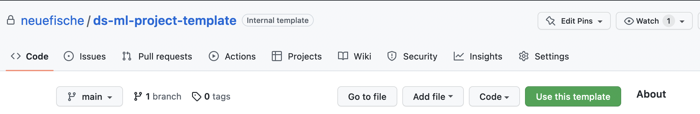
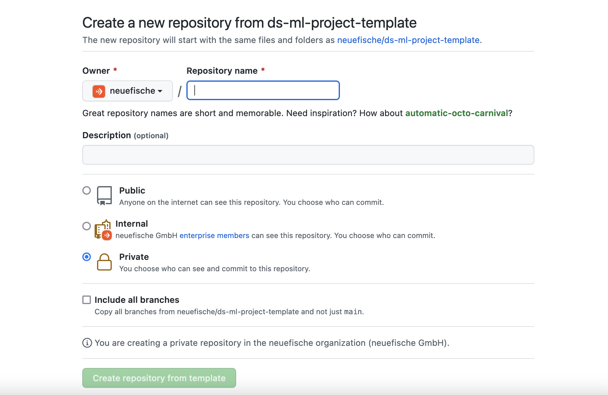
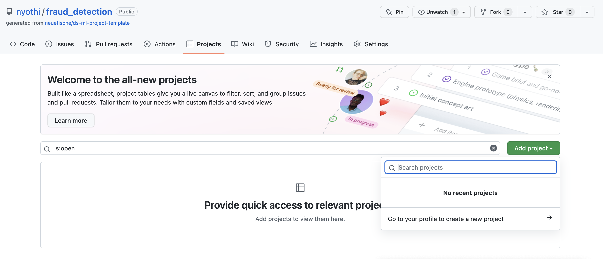
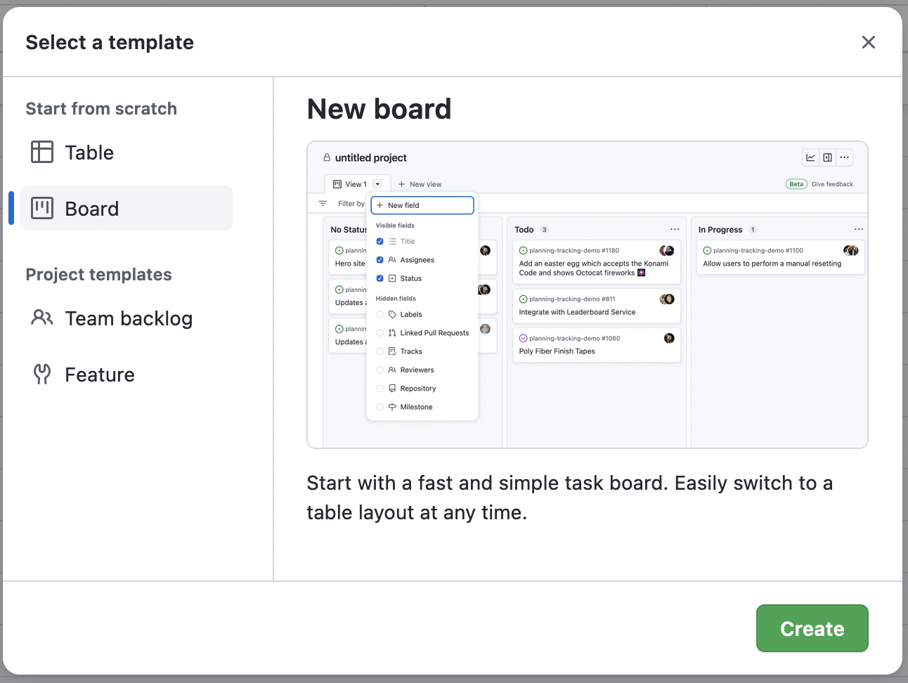
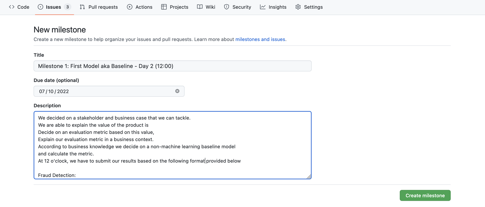
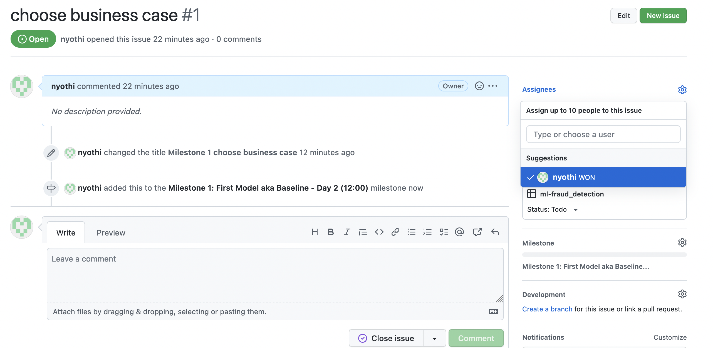

# Template Repo for ML Project

This template repo will give you a good starting point for your second project. Besides the files used for creating a virtual environment, you will find a simple example of how to build a simple model in a python script. This is maybe the simplest way to do it. We train a simple model in the jupyter notebook, where we select only some features and do minimal cleaning. The output is then stored in simple python scripts.

The data used for this is: [coffee quality dataset](https://github.com/jldbc/coffee-quality-database).

---

## Set up a Kanban board on github

Go to ML-Project Template.

Click on the Template (Green button)


Create new project with relevant name, under own account and **not** Neuefische.



On your profile, navigate to and click on "projects", and then click on "Add project". Finally click the arrow navigation to create project on your profile. 



Choose "board" view and **not** "table" view, then click "create".
Good, now you have a board view. 


Now change the name of your board, to match that of your chosen ML project. 

Next, assign rights to all your team members by clicking on the 3 dots on the top right of the board, and then go to "settings". 

Next, click on "Manage Access"
Add your team mates by Searching for their github handle in the search window.

Change their Role from ‘View’ to ‘Admin’ 
Click on the green button “Invite” to add them. Repeat for all team members.


Next, add action items with the relevant name e.g. “load data”, "get statistics", etc.

Convert added item to issue by clicking on the 3 dots on the particular added item.

Then select the repo you created in step3 for the issue to be added. (Select the project repo example “Fraud detection”)


Optional
(Navigate to workflows, activate the ones you feel necessary to your project,
Go back to your project repository (fraud detection) )

When in project repo, Go to issues, then go to milestones. 

Click on ”Add milestone”.

Give the milestone a due date and description as per the example provided by the coaches. 

Add description of: 

A) What needs to be completed to be done with the milestone

B) The submission style (per format provided)


Now navigate to "issues".

Assign issues as milestones, give it assignees, no labels needed but feel free to. 



## Requirements and Environment

Requirements:
- pyenv with Python: 3.9.8

Environment: 

For installing the virtual environment you can either use the Makefile and run `make setup` or install it manually with the following commands: 

```Bash
pyenv local 3.9.8
python -m venv .venv
source .venv/bin/activate
pip install --upgrade pip
pip install -r requirements.txt
```

## Usage

In order to train the model and store test data in the data folder and the model in models run:

```bash
#activate env
source .venv/bin/activate

python example_files/train.py  
```

In order to test that predict works on a test set you created run:

```bash
python example_files/predict.py models/linear_regression_model.sav data/X_test.csv data/y_test.csv
```

## Limitations

Development libraries are part of the production environment, normally these would be separate as the production code should be as slim as possible.


